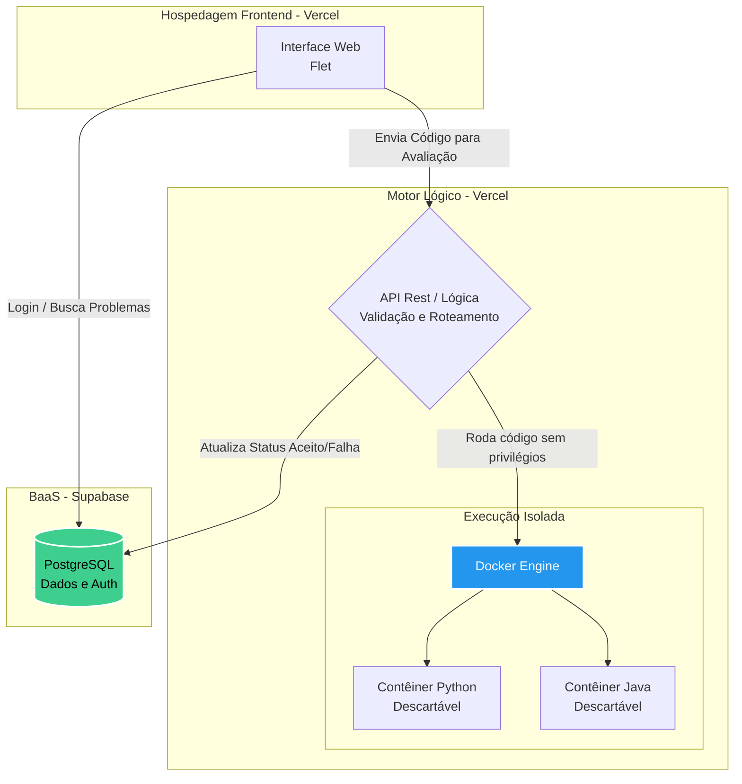
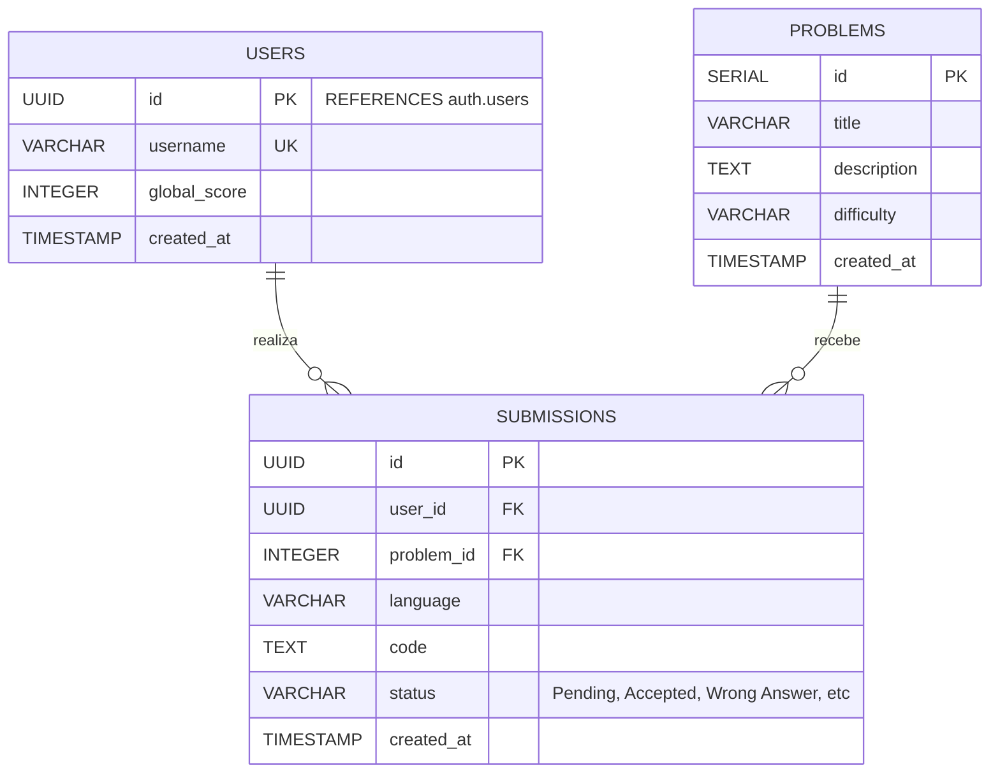

<p align="center">
<h1 align="center">🚀 CodeRank: Plataforma Competitiva de Programação</h1>

<p align="center">
  <a href="https://www.python.org/"></a>
  <a href="https://flet.dev/"></a>
  <a href="https://www.docker.com/"></a>
  <a href="https://supabase.com/"></a>
  <a href="https://vercel.com/"></a>
<br>

O **CodeRank** é uma aplicação educacional desenvolvida em Flet que permite aos usuários competir e resolver desafios de programação. 

🌟 **O Nosso Diferencial:** O sistema conta com um motor de **execução isolada de código (Sandbox)**. Em vez de rodar submissões em um ambiente aberto, o código do usuário é enviado para contêineres Docker descartáveis, sem acesso à rede, com recursos controlados e sistema de arquivos bloqueado. Isso garante uma avaliação segura contra códigos maliciosos.

---

## 📸 Demonstração do Sistema

### Telas da Aplicação
<!-- Arraste as imagens (Login, Desafios, Grupos) aqui e deixe o link que o GitHub gerar -->


### Sistema em Ação

<table align="center">
  <tr>
    <th align="center"> Resolução de Desafios </th>
  </tr>
  <tr>
    <td align="center" width="50%">
      <!-- Quando tiver o vídeo do sistema rodando, substitua o link falso abaixo pelo real -->
      ## 📸 Demonstração do Sistema

### Sistema em Ação
Assista abaixo à gravação do CodeRank em funcionamento:

<video src="https://github.com/user-attachments/assets/e5d714bc-1987-4140-9208-f62e04c4e802" controls="controls" width="100%"></video>
    </td>
</table>

---

## 🧠 Arquitetura do Sistema

O sistema é distribuído entre o Frontend (Flet), Backend (Lógica de contêineres na Vercel) e Banco de Dados (Supabase).



## Diagrama de Classes (UML)

O modelo estrutural abaixo representa os objetos, atributos e métodos projetados para a camada de aplicação do sistema, guiando o desenvolvimento da interface e as integrações.

## Modelagem do Banco de Dados

O banco de dados relacional utiliza PostgreSQL (hospedado no Supabase), sendo integrado diretamente com o auth.users do Supabase para gestão de identidade.


## ⚙️ Como o Sandbox (Execução Isolada) Funciona?

### O editor envia o código pela entrada padrão (stdin) para um contêiner novo e descartável. Para garantir total segurança, cada execução possui as seguintes travas:

    Usa uma imagem previamente construída, sem montar diretórios da máquina host.

    Não possui acesso à rede (--network none).

    Executa com usuário sem privilégios e todas as capabilities removidas.

    Usa sistema de arquivos somente leitura, exceto por uma área temporária muito limitada (--tmpfs).

    Possui limites rígidos de CPU, memória, processos, tamanho do código e tempo de execução.

    Destrói o contêiner automaticamente ao finalizar ou exceder o timeout.

    Nota: O Python é executado com o interpretador em modo isolado. O Java exige uma classe pública chamada Main e é compilado com Java 21 antes da execução.

## 🚀 Configuração e Execução Local
### Pré-requisitos

    Python 3.13 ou superior

    Docker Desktop com o motor Docker em execução

## Preparando o Ambiente

### No PowerShell, a partir da raiz do projeto, execute:

```
# Cria e ativa o ambiente virtual
python -m venv .venv
.\.venv\Scripts\Activate.ps1

# Instala as dependências
python -m pip install -r requirements.txt

# Constrói as imagens locais do Sandbox
docker compose build

# Inicia a aplicação
python main.py
```

O comando docker compose build é crucial, pois cria as duas imagens base usadas nas avaliações:

    coderank-python:latest

    coderank-java:latest

## Testes

### Os testes unitários da aplicação não precisam do motor Docker rodando:

```
python -m unittest discover -s tests -v
```
Para conferir manualmente as imagens isoladas depois de iniciar o Docker Desktop:

## Teste Python:
```
echo 'print("sandbox python ok")' | docker run --rm -i --network none --read-only --tmpfs /tmp:rw,noexec,nosuid,size=64m coderank-python:latest
```
## Teste Java:
```
echo 'public class Main { public static void main(String[] args) { System.out.println("sandbox java ok"); } }' | docker run --rm -i --network none --read-only --tmpfs /tmp:rw,noexec,nosuid,size=128m coderank-java:latest
```
